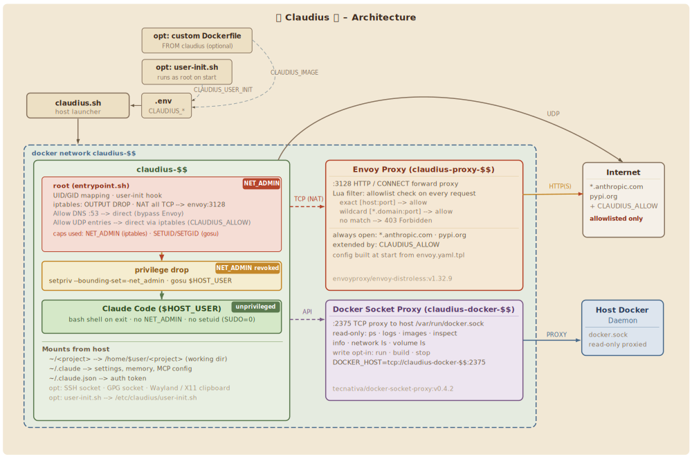

# 🌿 claudius 🏛️

The Roman emperor Claudius (reigned 41–54 CE) spent much of his early life marginalized, kept from public office, mocked for his physical disabilities, and largely written off by his own family. When he unexpectedly became emperor after Caligula's assassination, he proved his detractors wrong. He reformed the imperial bureaucracy, presided personally over legal cases, built the harbour at Ostia, and conquered Britain. Ancient sources, written mostly by senatorial aristocrats who resented his reliance on freedmen administrators, tend to paint him as bumbling or manipulated. The reality is more interesting: a deeply learned man, shaped by years of enforced observation rather than action, who governed with procedural seriousness and got more done than most.

He was not without political violence. He authorized executions, navigated treacherous court intrigue, and was no stranger to ruthlessness when he felt it necessary. But he thought before he acted. A fitting patron for an agent that runs in a box — this is that box.

---

## Overview

claudius is built to contain risk without getting in the way. A hardened sandbox for your local dev workstation that lets Claude Code do its job while keeping the host safe. Locked down by default; network egress, Docker access, SSH, clipboard, and sudo are all opt-in risks you control. Language servers and Gemini MCP included out of the box; extensible via custom docker images or a runtime init hook.



| Component | Details |
| --- | --- |
| Base image | `node:22-bookworm-slim` |
| Claude Code | native installer (`claude.ai/install.sh`) |
| Gemini MCP | [`@rlabs-inc/gemini-mcp`](https://github.com/RLabs-Inc/gemini-mcp) — 30+ tools: image/video generation, deep research, code execution, and more |
| Language servers | `pyright` (Python), `typescript-language-server` (TS/JS), `bash-language-server`, `vscode-langservers-extracted` (JSON/HTML/CSS/Markdown), `yaml-language-server`, `sql-language-server` |
| Shell | bash + [Starship](https://starship.rs) prompt |
| Packages | git, curl, wget, vim, less, ping, mtr, jq, make, python3, pip3, sqlite3, sudo, tree, unzip, netcat, lsof, strace, tcpdump, ssh, docker CLI, gnupg, wl-clipboard, xclip |

---

## Setup

```bash
make install
```

Symlinks `claudius` into `~/.local/bin`. First run builds the image (~2 min once), after that it starts instantly.

```bash
make build      # build image (cached)
make rebuild    # rebuild without cache, updates Claude Code
make uninstall  # remove the symlink
```

**Optional: gVisor runtime**

[gVisor](https://gvisor.dev) adds a user-space kernel between the container and the host — the strongest isolation available without a full VM. Works with SSH, GPG, and clipboard forwarding.

```bash
make gvisor-install   # install runsc, register with Docker, configure daemon
make gvisor-configure # update daemon flags only (no reinstall)
make gvisor-uninstall # remove gVisor runtime
make gvisor-check     # verify installation
```

Then use it per-session with `CLAUDIUS_RUNTIME=runsc claudius ~/myproject`, or set it in `.env`.

---

## Usage

```bash
claudius              # mount current directory, start claude
claudius ~/my-project # mount a specific directory
claudius bash         # shell only
```

Claude starts automatically. `/exit` or Ctrl+C drops you into a shell; exiting that closes the container.

Non-interactive use works too:

```bash
claudius bash -c 'git log --oneline -5'
claudius bash -c 'claude -p "summarize this repo in one paragraph"'
```

The project directory is mounted at `/home/$USER/<dirname>`. Files you create or edit show up on the host immediately — permissions are correct because the container runs as your UID/GID.

---

## Configuration

Set variables in a `.env` file next to `claudius.sh` (see `.env.example`), or pass them inline:

```bash
CLAUDIUS_MEMORY=8g CLAUDIUS_CPUS=8 claudius
```

**Resources**

| Variable | Default | Description |
| --- | --- | --- |
| `CLAUDIUS_MEMORY` | `4g` | Container memory limit |
| `CLAUDIUS_CPUS` | `4` | Container CPU limit |

**Network**

| Variable | Default | Description |
| --- | --- | --- |
| `CLAUDIUS_DNS` | `1.1.1.1 1.0.0.1 8.8.8.8 8.8.4.4` | DNS resolvers (space-separated; IPv6 supported) |
| `CLAUDIUS_ALLOW` | unset | Allowed outbound destinations — see [docs/security.md#claudius_allow](docs/security.md#claudius_allow) |

**Features**

| Variable | Default | Description |
| --- | --- | --- |
| `CLAUDIUS_NO_PROXY` | `0` | `1` = skip proxy sidecar entirely — unrestricted outbound network |
| `CLAUDIUS_SSH` | `0` | `1` = forward SSH agent and open `*:22/tcp` |
| `CLAUDIUS_GPG` | `0` | `1` = forward GPG agent socket |
| `CLAUDIUS_CLIPBOARD` | `1` | `0` = disable clipboard forwarding (Wayland/X11) |
| `CLAUDIUS_DOCKER_WRITE` | `0` | `1` = enable docker write ops (default: inspect only) |
| `CLAUDIUS_SUDO` | `0` | `1` = enable sudo for package managers |
| `CLAUDIUS_SUDO_CMDS` | `apt apt-get pip pip3 npm` | Commands allowed via sudo when `CLAUDIUS_SUDO=1` |
| `CLAUDIUS_RUNTIME` | unset | Docker runtime: `runsc` (gVisor). Default uses runc. |

---

## Extending

The base image is intentionally minimal. Two ways to add your own tools:

| Variable | Default | Description |
| --- | --- | --- |
| `CLAUDIUS_IMAGE` | `claudius` | Docker image to run — set to a custom image name to use an extended image |
| `CLAUDIUS_USER_INIT` | unset | Path to a shell script on the host — mounted read-only and run as root before Claude starts |

### Custom image (recommended)

Create a `Dockerfile` that extends `claudius`, build it once, and point `CLAUDIUS_IMAGE` at it:

```bash
docker build -t claudius-go -f docker/claudius/Dockerfile.go.example .
CLAUDIUS_IMAGE=claudius-go claudius ~/my-go-project
```

Ready-made examples in `docker/claudius/`:

| File | Adds |
| --- | --- |
| `Dockerfile.go.example` | Go 1.24 (multi-stage) + `gopls` |
| `Dockerfile.flutter.example` | Flutter SDK (includes Dart + language server) + Android SDK + `flutter analyze/build apk/linux/web` |
| `Dockerfile.rust.example` | Rust stable + `rust-analyzer` |

All examples follow the same pattern — copy the file, adjust as needed, build once:

```dockerfile
FROM claudius

# add your tools here

ENV PATH="/your/tool/bin:${PATH}"
```

### Runtime init hook

Mount a shell script at `/etc/claudius/user-init.sh`. It runs as root before Claude starts — useful for lightweight per-start config like git identity or aliases. Not for installing packages (use a custom image for that).

```bash
# user-init.sh
git config --file "/home/${HOST_USER}/.gitconfig" user.email "me@example.com"
git config --file "/home/${HOST_USER}/.gitconfig" user.name "My Name"
echo "alias ll='ls -lah'" >> "/home/${HOST_USER}/.bashrc"
```

To export env vars or PATH additions to Claude, write to `/etc/claudius/user-env.sh` — the entrypoint sources it before the privilege drop:

```bash
echo 'export MY_TOKEN=xyz' >> /etc/claudius/user-env.sh
```

Pass it via `CLAUDIUS_USER_INIT`:

```bash
CLAUDIUS_USER_INIT=./user-init.sh claudius ~/my-project
# or in .env:
# CLAUDIUS_USER_INIT=/home/you/dotfiles/claudius-init.sh
```

A template is at `user-init.sh.example`.

---

## Security

Locked down by default. Every opt-in (`CLAUDIUS_ALLOW`, `CLAUDIUS_SSH`, `CLAUDIUS_SUDO`, etc.) expands the attack surface in a specific, documented direction. claudius protects the host from the agent — your project files and prompting are another matter.

| Measure | Detail |
| --- | --- |
| Isolated filesystem | Project dir, `~/.claude/`, `~/.claude.json` — no other host paths |
| Network firewall proxy (optional) | All TCP transparently proxied (SNI/Host ACL); UDP/ICMP via NFQUEUE (fail-closed); host-side enforcement, works with runc and gVisor |
| Capability drop | `--cap-drop ALL` + minimal additions; `sudo` inert by default |
| Privilege drop | `gosu` + `setpriv --no-new-privs` — no root process remains after startup |
| gVisor (optional) | `CLAUDIUS_RUNTIME=runsc` — user-space kernel, strongest isolation short of a VM |
| Docker socket | Inspect-only proxy; write ops require `CLAUDIUS_DOCKER_WRITE=1` |
| Managed policy | `CLAUDE.md` baked into image at highest precedence — prompt-level guardrails |

Full details — mounts, network filtering, privilege drop, threat model: [docs/security.md](docs/security.md)
